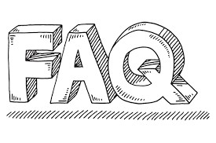

<!--  -->

Javascript has been the backbone of many web development aspects. Getting a job in web development as a javascript(er) is not that hard. Regular practice and some tips and tricks can get you to shine in the job interview. Here are a few frequently asked questions in Javascript. 

Pat yourself if you know them.





## Question 1 Difference between “==” and “===”?

”==” only compares values. “===” compare values and type both.

  

In the above code snippet, the value of true is 1, whereas the type of true is boolean. 

So `true === 1` will return `false` as its type is not 1.


## Question 2 What is the output of “document.write({});” and “console.log({});”

<!-- | Syntax | Description |
| ----------- | ----------- |
| document.write({});|[object Object]|
| console.log({});|{}| -->  

  

  

Basically, the curly braces `{}` are another way for creating objects in javascript. This is equivalent to the "new Object()" syntax which creates new Object literal 


## Question 3 What is the ‘Strict’ mode in JavaScript and how can it be enabled? 

Strict mode is a way to introduce better error-checking into your code.

When you use strict mode, you cannot use implicitly declared variables, or assign a value to a read-only property, or add a property to an object that is not extensible.

You can enable strict mode by adding “use strict” at the beginning of a file, a program, or a function.


## Question 4 Compute the output.*  

```javascript
var Y = 1;
if (function F(){})
{
    Y += typeof(F);
}
console.log(Y);
```

  

The output would be `1undefined`. 

The if condition statement evaluates using eval, so `eval(function F(){})` returns `function F(){}` - which is `true`. 

Therefore, inside the if statement, executing `typeof F` returns undefined because the if statement code executes at run time, and the statement inside the if condition is evaluated during run time.

## Question 5 Compute the output.

```javascript
var ob1= null;
var ob2= function a(){};
console.log(typeof ob1 === "object");
console.log(typeof ob2 === "object");
```

  

`null` is an object whereas a function isn't. The function can be stored in a variable. The type of that stored variable will be of type function only

---

## Question 6 Tell about unescape() and escape()

### Unescape

It decodes the coded string.

Also computes a new string in which hexadecimal escape sequences are replaced with the character that it represents
  
  

### Escape

It encodes the coded string.

Also computes a new string in which certain characters have been replaced by a hexadecimal escape sequence
  


## Question 7 What do you understand by Closures in JavaScript?

A closure gives you access to an outer function's scope from an inner function. Even you can pass arguments to the inner function

  

The function `sumMsg()` uses the variables `a and b` defined in the outer `function sum(a,b)`

---

## Question 8 Event Bubbling in JavaScript

Event propagation in HTML DOM API

If you click on 'HI', the "I am the first" will be invoked, then followed by I am in between then I am last" as shown below

  

It's like the circular waves. It starts from the inside.

```HTML
<style>
  body  {
    margin: 10px;
    border: 1px solid blue;
  }
</style>

<form onclick="alert('I am Last')">BYE

  <div onclick="alert('I am inbetween')">INBETWEEN

    <p onclick="alert('I am the first')">HI</p>
  </div>
</form>
```

  

`onclick` is invoked when HI is clicked

  

The next `onclick` is invoked after OK is clicked in the dialog box

  
The last `onclick` is invoked after OK is clicked in the dialog box


<!-- ## Conclusion -->


> Author: Jairam Bala<br>
> I am Jairam, a Software Developer at Accenture. Software and Tech Enthusiast. Freelancer too.
> Email: b.jairam0512@gmail.com<br>

---

<br>

#### Further Resources We Recommend

- [You Don`t Know JS (ES6 & Beyond)](https://amzn.to/2GGox8Y)

<br>

## Read Next

[5 Common mistakes JavaScript developers make](/posts/steps-after-you-type-url-in-browser)